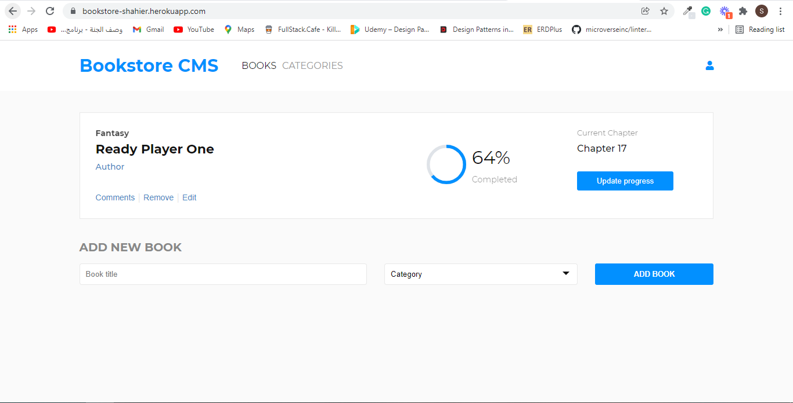

# Bookstore

> Project for view, add, and delete books.

## Built With

- HTML, CSS, and JavaScript
- React
- git/GitHub

## Live Demo

[Live Demo Link](https://github.com/ShahierNashaat/bookstore)

## Getting Started

To get a local copy up and running follow these simple example steps.

- go to the directory that you want to clone the repository in.
- right click and choose Git Bash here.
- type "git clone https://github.com/ShahierNashaat/bookstore.git".
- run "npm install" and then "npm start"

## Authors

👤 **Shahier Nashaat**

- GitHub: [@githubhandle](https://github.com/ShahierNashaat)
- Twitter: [@twitterhandle](https://twitter.com/ShahierN)
- LinkedIn: [LinkedIn](https://www.linkedin.com/in/shahier-nashaat-73519313a/)

## 🤝 Contributing

Contributions, issues, and feature requests are welcome!

Feel free to check the [issues page](../../issues/).

## Show your support

Give a ⭐️ if you like this project!

## Acknowledgments

- Hat tip to anyone whose code was used
- Inspiration
- etc

## 📝 License

This project is [MIT](./MIT.md) licensed.
